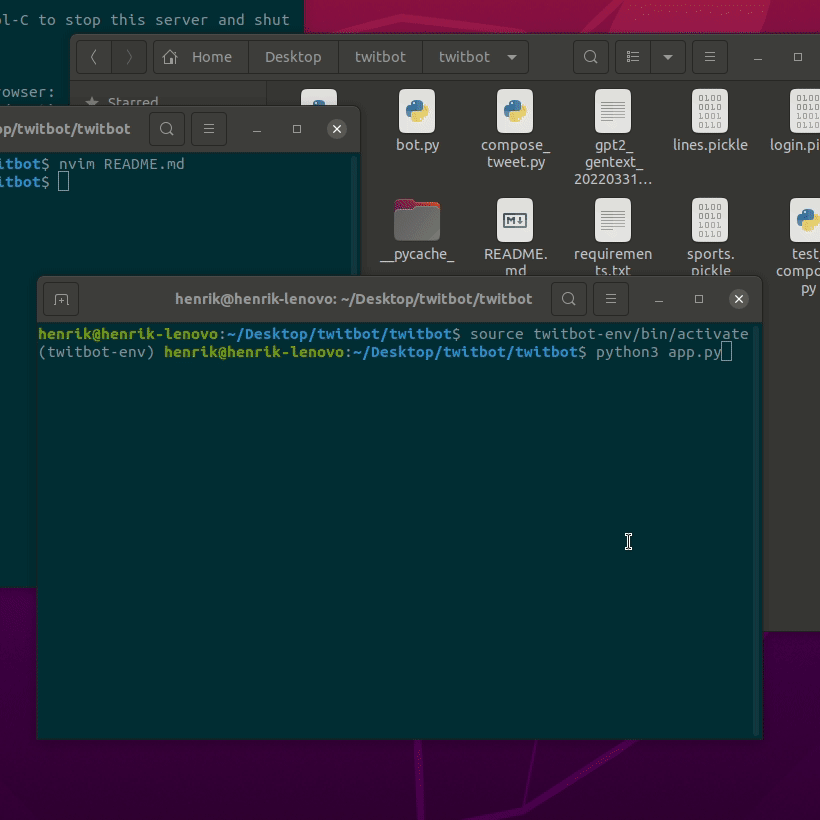

# A selenium bot that twwets lines generated in a gpt-2-model

I used a model pre-trained on swedish texts and poetry from Svensk Sci Fi and fine tuned it on my instagram posts to make it write more like me. The bot class logs in to twitter and post tweets, the composing module puts a generated, randomly selected string of text together with a trending subject as a hashtag together. The timing module uses quantum random to time the tweeting intervals. It also checks if the sun is up because it will only post by day. There is also a test module for testing the composing module. The model that i finetuned is to big to be included here but You can download the Karin Boye-model here <a href="http://www.svenskscifi.se/KarinBoye/checkpoint_PretrainedGPT-2KarinBoye.tar">PretrainedGPT-2KarinBoye</a> (9.95 GB) and then test it by running it at this free google colab resource <a href="https://colab.research.google.com/drive/1VLG8e7YSEwypxU-noRNhsv5dW4NfTGce">Run a GPT-2 Text-Generating Model</a> and finetune it to your own tweets.
<br />

- [Twitter](https://twitter.com/HenrikBjorserud) - My Twitter feed, automated.

<br />

## A GIF to quickly demonstrate the bot

<br />



<br />

## Build from sources

```bash
$ # Clone the sources
$ git clone https://github.com/henrikBjorserud/twitbot.git
$ cd twitbot
$
$ # Virtualenv modules installation (Unix based systems)
$ python3 -m venv "twitbot-env"
$ source twitbot-env/bin/activate
$
$ # Install requirements
$ pip3 install -r requirements.txt
$
$ # Replace "lines.pickle" with your own generated tweets or whatever you want and run the "app.py" (It will run indefinitely until you press ctrl + c)
$ 
$ python3 app.py
$
```

<br />


## Credits & Links

- [GPT-2](https://github.com/openai/gpt-2) - Open AI:s GPT-2 model
- [Svensk Sci Fi](https://github.com/svenskscifi/karinboye) - The Karin Boye model by Svensk Sci Fi
- [NeoVim](https://neovim.io/) - NeoVim, a shout-out to a beatutiful hyperextensible Vim-based text editor

<br />


